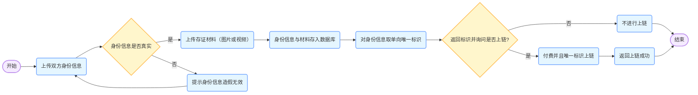
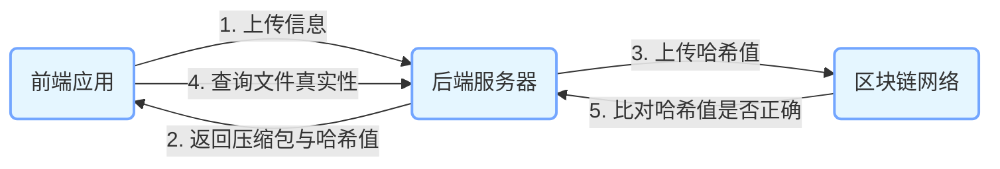

# DatingWithNoScruple
一款基于Tron链的赛前契约应用

## 场景应用

“球赛”是足篮球运动员很热衷参与的一项活动。

然而，在一些球赛中，由于双方运动员主动或被动寻求身体对抗，造成某一方又或者无预谋的对赛场行为进行争议性诉讼，并因此造成参与这类运动的成员受到不应受到的惩罚，进而造成大家畏惧或者不愿意参与这类运动。

DatingWithNoScruple这款应用，基于Tron链的广泛可信度以及较低的上链价格，在赛前将双方的保证存证并且取哈希上链，以确保赛后大家对于赛中发生内容不引起争议，最终促成良好的竞赛环境。

### 竞赛场景存在问题分析

1. 如何保证信息的真实性以及可信性？
2. 如何保证隐私信息不被泄漏，比如有人不想让我约球，怕被发现？
3. 如何确保我是赛前签署的？

## 数据存储方式

### 问题解决

基于以上流程，解决上述两个问题

1. 确保存证的内容是可靠的
   - 确保上传的身份是真实的（采用读ID卡方式的NFC驱动）
   - 确保存证的内容是被法律承认的（纸质契约图片、视频等等）
2. 如何确保上链信息不被获取
   - 云端仅存储哈希值与加密后ID的对应信息
   - 上链的信息仅有单向加密后的哈希值、无法反推原始内容
3. 时间戳+内容存证
   - 上链区块的时间戳可以作为存证的内容
   - 上链的内容中加入时间信息

## 项目架构以及发展

### 架构流程

1. 首先使用中心化架构，后端接收上传的内容，打包取哈希值
2. 之后将压缩包返回给双方用户，并且将哈希值存储于中心服务器或者上链
3. 当存在后续争议时，可以上传文件，并且校验哈希值确保文件没有被篡改

### 发展

1. Version1: 完成身份信息的Web端输入以及上传，哈希计算以及上链操作
2. Version2: 完成项目从中心化到dApp的架构转变
3. Version3: 完成项目的刷卡信息录入功能
4. Version4：......
